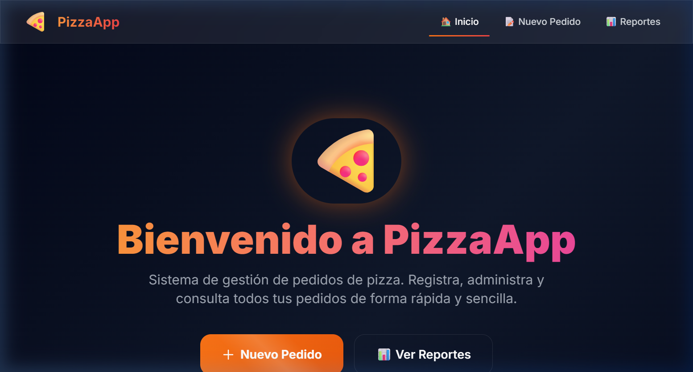
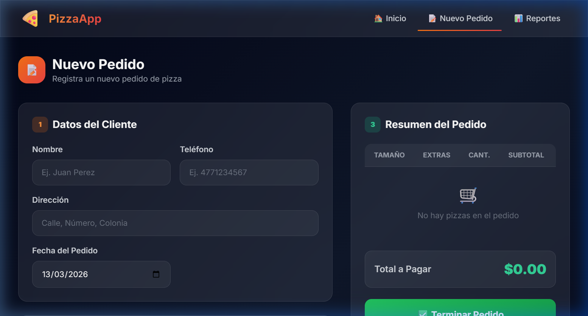
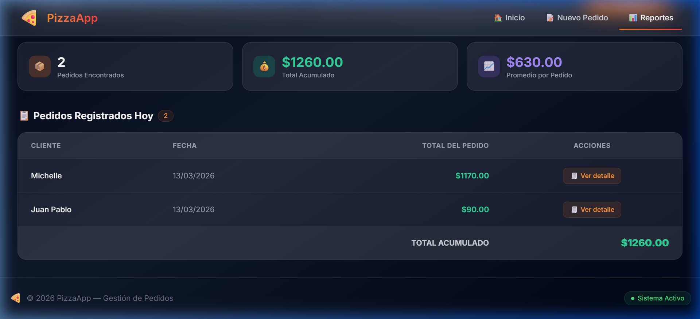
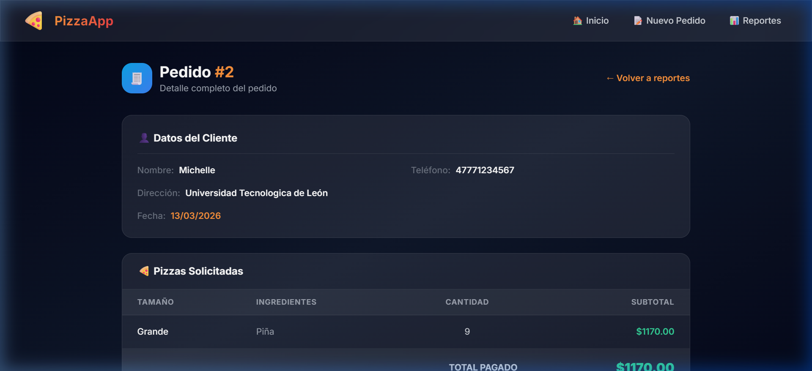

# 🍕 PizzaApp — Sistema de Gestión de Pedidos

<div align="center">


**Sistema web moderno para la gestión integral de pedidos de pizza.**  
Registra clientes, arma pedidos personalizados y consulta reportes de ventas en tiempo real.

</div>

---

## 📸 Capturas de Pantalla

### Página de Bienvenida
> Vista principal con estadísticas del día y acceso rápido a las funciones principales.



### Nuevo Pedido
> Formulario intuitivo para registrar clientes, armar pizzas y gestionar el carrito de pedido.



### Reportes de Ventas
> Vista unificada con pedidos del día, búsqueda por día/mes y acceso al detalle de cada venta.



### Detalle del Pedido
> Desglose completo de cada venta: datos del cliente, pizzas solicitadas y total pagado.



---

## ✨ Características

- 🏠 **Página de bienvenida** con estadísticas en tiempo real (pedidos del día, ventas, clientes)
- 📝 **Registro de pedidos** con formulario dinámico y carrito interactivo
- 🍕 **Armado de pizzas** personalizado (tamaño + ingredientes + cantidad)
- 📊 **Reportes unificados** con búsqueda por día de la semana o por mes
- 🧾 **Detalle de venta** con desglose completo de pizzas incluidas en el pedido
- 🗄️ **Migraciones de BD** con Flask-Migrate (Alembic) integrado
- 🎨 **Interfaz moderna** con tema dark premium, glassmorphism y animaciones suaves
- ⚡ **Responsive** — se adapta a cualquier dispositivo

---

## 🛠️ Tecnologías

| Tecnología | Uso |
|---|---|
| **Python 3.10** | Lenguaje principal |
| **Flask 3.1** | Framework web |
| **SQLAlchemy** | ORM para base de datos |
| **Flask-Migrate** | Migraciones de la base de datos |
| **Flask-WTF** | Manejo y validación de formularios |
| **MySQL 8 (PyMySQL)** | Base de datos relacional |
| **Tailwind CSS (CDN)** | Estilos y diseño responsivo |
| **Google Fonts (Inter)** | Tipografía moderna |

---

## 📁 Estructura del Proyecto

```
examenPizzas/
├── app.py                  # Punto de entrada de la aplicación
├── config.py               # Configuración (DB, secret key)
├── models.py               # Modelos SQLAlchemy (Cliente, Pedido, Pizza, DetallePedido)
├── forms.py                # Formularios WTForms
├── requirements.txt        # Dependencias del proyecto
│
├── main/                   # Blueprint principal
│   ├── __init__.py
│   └── routes.py           # Ruta de bienvenida (/)
│
├── pedidos/                # Blueprint de pedidos
│   ├── __init__.py
│   └── routes.py           # CRUD de pedidos y detalle
│
├── reportes/               # Blueprint de reportes
│   ├── __init__.py
│   └── routes.py           # Reportes unificados
│
├── templates/              # Plantillas Jinja2
│   ├── layout.html         # Layout base (dark theme)
│   ├── welcome.html        # Página de bienvenida
│   ├── index.html          # Formulario de nuevo pedido
│   ├── 404.html            # Página de error
│   ├── _macros.html        # Macros reutilizables
│   ├── pedidos/
│   │   └── detalle.html    # Detalle de un pedido
│   └── reportes/
│       └── reportes.html   # Vista unificada de reportes
│
├── migrations/             # Migraciones Alembic
│   └── versions/           # Historial de migraciones
│
└── static/                 # Archivos estáticos
    └── src/
```

---

## 🚀 Instalación y Ejecución

### Prerrequisitos
- Python 3.10+
- MySQL 8.0+
- Git

### Pasos

1. **Clonar el repositorio**
   ```bash
   git clone https://github.com/IDGS-801-23000940/examenPizzas.git
   cd examenPizzas
   ```

2. **Crear y activar el entorno virtual**
   ```bash
   python -m venv venv
   .\venv\Scripts\Activate.ps1    # Windows PowerShell
   # source venv/bin/activate     # Linux/Mac
   ```

3. **Instalar dependencias**
   ```bash
   pip install -r requirements.txt
   pip install Flask-Migrate cryptography
   ```

4. **Configurar la base de datos**
   - Crear la base de datos `pizzas` en MySQL:
     ```sql
     CREATE DATABASE pizzas;
     ```
   - Ajustar credenciales en `config.py` si es necesario (por defecto: `root:admin`)

5. **Ejecutar la aplicación**
   ```bash
   python app.py
   ```

6. **Abrir en el navegador**
   ```
   http://127.0.0.1:5000
   ```

---

## 📋 Comandos de Migración

```bash
# Inicializar migraciones (solo la primera vez)
flask db init

# Generar una nueva migración tras cambios en models.py
flask db migrate -m "descripcion del cambio"

# Aplicar migraciones pendientes
flask db upgrade

# Revertir la última migración
flask db downgrade
```

---

## 📊 Modelo de Datos

```
┌──────────────┐       ┌──────────────┐       ┌──────────────┐
│   clientes   │       │   pedidos    │       │    pizzas    │
├──────────────┤       ├──────────────┤       ├──────────────┤
│ id_cliente PK│◄──────│ id_cliente FK│       │ id_pizza  PK │
│ nombre       │       │ id_pedido  PK│──┐    │ tamano       │
│ direccion    │       │ fecha        │  │    │ ingredientes │
│ telefono     │       │ total        │  │    │ precio       │
└──────────────┘       └──────────────┘  │    └──────┬───────┘
                                         │           │
                                         │    ┌──────┴───────┐
                                         └───►│detalle_pedido│
                                              ├──────────────┤
                                              │ id_detalle PK│
                                              │ id_pedido  FK│
                                              │ id_pizza   FK│
                                              │ cantidad     │
                                              │ subtotal     │
                                              └──────────────┘
```

---

## 🧑‍💻 Desarrollado por

<div align="center">

**Pablo Cano**

[](https://github.com/IDGS-801-23000940)

</div>
